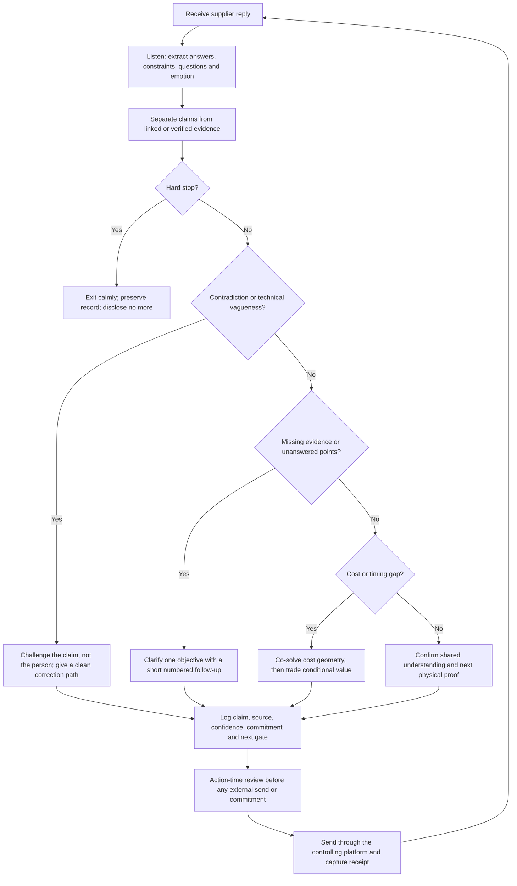

# VORG-EAVY Human-Aware Supplier Negotiation v1.0

**Created:** 2026-08-01  
**Decision supported:** How VORG-EAVY can negotiate with manufacturers as a serious, culturally aware founder while protecting product truth, relationships and a C$5,000-C$6,000 inventory ceiling.  
**Truth status:** Operating policy and tested decision engine; not a claim that software is conscious or that any supplier is approved.  
**Authority boundary:** The engine may interpret replies, expose uncertainty, propose trades and draft bilingual messages. It cannot auto-send, invent leverage, accept terms, authorize a sample, promise volume, spend money or approve bulk.

## What “conscious” means here

The system is deliberately **human-aware**, not sentient. It keeps two tracks separate:

1. **Relationship track:** listens, acknowledges constraints, respects face, rewards candour, uses the supplier's name, and makes one clear request at a time.
2. **Truth track:** verifies identity, comparable work, construction, materials, subcontractors, quotation scope, protected payment and physical sample evidence.

Warmth never upgrades evidence. A supplier can be friendly and still fail. A supplier can state a difficult limitation and gain trust because the limitation is specific, consistent and useful.

## The negotiation loop

## Decision order

Every reply is interpreted in this order:

1. **Safety and integrity:** personal/off-platform payment, hidden subcontracting, inspection refusal, fabricated evidence or bulk pressure stops the conversation.
2. **Contradictions:** reconcile legal name, site, company role, material, MOQ, price basis and subcontractor claims before bargaining.
3. **Comprehension:** a sales answer does not replace a patternmaker or production-technician answer.
4. **Evidence:** classify every important statement as `claimed`, `linked`, `verified` or `contradicted`.
5. **Commercial clarity:** separate material, development, labour, specialist work, testing, packing, freight, revision and payment terms.
6. **Relationship:** acknowledge a real constraint and leave room for an honest “no” or an alternative.
7. **Reciprocity:** VORG-EAVY does not give a material concession unless the supplier gives measurable value in return.
8. **Approval:** drafts do not become sends, and discussions do not become orders, without the controlling action gate.

## Negotiation postures

| Posture | Trigger | Voice | Goal |
|---|---|---|---|
| Listen | Reply is clear, evidenced and reciprocal | Warm, curious | Confirm the largest remaining risk |
| Clarify | Answers or evidence are incomplete | Warm; firm if evasive | Close one high-value gap |
| Challenge | Contradiction or generic technical answer | Calm and specific | Correct the record without humiliating the contact |
| Co-solve | Cost/timing structure is not yet transparent | Collaborative | Build cost geometry before asking for a discount |
| Bargain | Evidence is strong and a quantified gap remains | Warm-firm | Trade value conditionally |
| Hold | VORG has conceded more than the supplier | Calm-firm | Stop unilateral concessions |
| Exit | Identity, payment, inspection, substitution or bulk-pressure stop | Short and respectful | Protect cash and evidence |

## Fair leverage VORG-EAVY may use

Use leverage only when true and documented:

- a controlled tech pack that reduces pattern and interpretation waste;
- fast, consolidated feedback inside an agreed review window;
- one decision-maker and a clean revision log;
- flexible development timing where it does not threaten launch gates;
- acceptance of in-stock development material for a fit shell when differences are documented and no production equivalence is claimed;
- simplified sample packaging when protection is preserved and the saving is itemized;
- a sample/pattern-fee credit against a **later separately approved** order;
- verified competing quotes on the same Incoterm, material, test, packaging and quantity basis.

Never use a fabricated quote, false deadline, imaginary influencer, guaranteed reorder or unapproved volume forecast. Do not reveal the full C$6,000 ceiling as an opening target; negotiate comparable landed cost and cash exposure by style.

## Reciprocity ledger

Every concession has an owner, value, condition and status.

| VORG-EAVY may offer | Supplier reciprocal ask |
|---|---|
| Feedback within an agreed window | One defined revision included |
| Simpler sample packaging | Itemized saving and same garment protection |
| In-stock material for a fit shell | Difference sheet plus final-material swatch/test path |
| Flexible non-critical timing | Lower rush/development charge or protected capacity date |
| Later sample-fee credit opportunity | Written credit amount and exact qualifying order condition |

The ledger uses relative `valuePoints`, never mixed-currency arithmetic. If accepted supplier value is less than 70% of accepted VORG value, the engine pauses and recommends a hold. The ratio is a negotiation control, not a price, exchange-rate calculation or financial accounting claim.

## Language and personality standard

- Address the actual contact and company; do not write “Dear supplier.”
- Open by recognizing the real work or constraint in their reply.
- Chinese may be used for rapport and clarity; the controlling technical specification and order terms stay in explicit written language both sides confirm.
- One message has one primary objective and no more than three immediate evidence asks.
- Say why an answer matters without teaching the supplier how to fabricate it.
- Reward precise limitations: “An honest limitation will not count against you.”
- Challenge the evidence, not the person's character.
- Close with the next shared proof, not vague enthusiasm.
- Avoid robotic phrases, excessive praise, threats and fake urgency.

## First-reply protocol for Topshow

When Judy replies to the VE-FJ-001 inquiry:

1. Preserve the complete Alibaba transcript and timestamp.
2. Map responses to questions 1-12 and mark skipped points.
3. Treat photos as claims until ownership context, inside/details and current proof connect them to Topshow.
4. Reward a specific no-cuff sleeve construction answer and any honest limitation.
5. Do not discuss discount until quote prerequisites, sample scope, revision rights and material availability are clear.
6. Ask no more than three follow-up items in the next message.
7. If the reply is a generic “yes, we can make it,” request a technician answer and the two most likely failure points.
8. If the reply proposes off-platform payment, a personal beneficiary, hidden outsourcing or bulk before sample approval, exit and preserve the evidence.

## Implementation

- `site/src/conscious-supplier-negotiator.ts` - typed decision and drafting source;
- `site/conscious-supplier-negotiator.js` - compiled local bundle;
- `site/tests/conscious-supplier-negotiator.test.mjs` - posture, safety, bilingual-draft and concession tests;
- `site/src/supplier-vetting-agent.ts` - supplier evidence and advancement gates.

The negotiation engine complements the vetting algorithm. It does not raise a supplier's evidence score and does not change `bulkAuthorized: false`.

## Known, assumed and unresolved

### Known

- VORG-EAVY's first-drop inventory/production ceiling is C$5,000-C$6,000 unless the founder changes it.
- VE-FJ-001 requires a straight continuous quilted sleeve with no separate cuff and a genuine-leather collar.
- Topshow's public profile claims remain unverified supplier/platform evidence.
- Alibaba Message Center records the complete bilingual Topshow inquiry at 2026-08-01 16:00 with message ID `20495410191`; the displayed state was `Unread` when verified at 17:18 EDT.

### Working assumptions

- Chinese rapport plus controlled English technical language will reduce avoidable ambiguity with this contact.
- A one-objective follow-up will produce more diagnostic evidence than another 12-question message after the first response.
- The best cost improvement may come from scope, timing, revision and material choices—not only a lower headline price.

### Unresolved

- Topshow's actual comparable work, legal production chain, leather/quilting capability, sample price, custom MOQ and protected-order acceptance.
- The exact Alibaba account Business Card details visible to the supplier.
- Why the contact form named Judy Huang while the resulting Topshow Message Center thread is labelled Kaye Luo; confirm the responsible sampling contact before relying on either name operationally.

## Next action

Wait for Topshow's reply without resending. Preserve the complete response, confirm the responsible sampling contact, map answers to questions 1-12, and feed the evidence gaps into the human-aware decision engine before drafting the next message.
