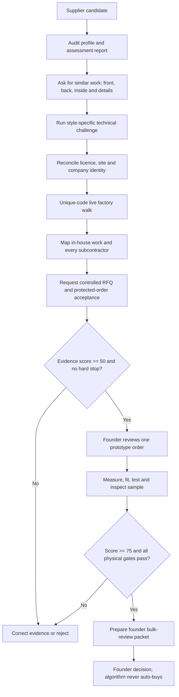

# VORG-EAVY Supplier Vetting Agent v1.0

**Checked:** 2026-08-01  
**Decision supported:** How VORG-EAVY can hold disciplined supplier conversations, turn claims into evidence, and decide who may receive an RFQ or one prototype order.  
**Authority boundary:** The agent may audit supplied links, score evidence, detect contradictions, and draft messages. Every outgoing platform message requires action-time founder approval. It cannot promise volume, approve a sample payment, alter an order, authorize bulk, or release funds.

## Operating decision

Use **Alibaba.com Message Center** as the controlling conversation channel for Drop 001. Use direct supplier inquiries for the named shortlist and an Alibaba RFQ only when VORG-EAVY wants additional challengers.

Why this platform:

- the current China candidates already have Alibaba pages or listings;
- Alibaba officially describes inquiries, instant messages, and RFQs as buyer-supplier communication routes;
- Verified Supplier profiles can expose downloadable third-party assessment reports and facility videos;
- Alibaba's buyer guidance says the online order, written specifications, platform payment, samples, and inspections are central to Trade Assurance protection;
- keeping important terms and corrections in the Message Center creates a stronger record than letting the controlling discussion disappear into WhatsApp or WeChat.

This does **not** make Alibaba, its badges, or its sellers automatically safe. Alibaba states that assessments come from third parties and disclaims a guarantee of seller or certificate accuracy. VORG-EAVY must still verify the exact legal entity, site, product process, sample, test evidence, order terms, and arrival quality.

## Supervision and platform-risk decision

**Risk rating:** Yellow for a supervised platform workflow; Red for an unofficial unattended messaging/scraping bot.

No official buyer messaging API suitable for this implementation was established during the current review. Alibaba's terms also prohibit systematic retrieval of site content without permission. V1 therefore uses:

1. a human-provided or manually reviewed supplier profile URL;
2. local evidence and contradiction scoring;
3. a VORG-EAVY message draft;
4. founder approval of the exact draft and attachments;
5. manual sending in the logged-in Alibaba account;
6. a linked transcript/evidence record after the reply.

Do not build CAPTCHA bypass, stealth automation, bulk unsolicited messages, systematic profile scraping, fake identities, or off-platform payment flows. If Alibaba later provides an approved buyer-messaging integration, re-review its permissions before changing the supervision model.

## The algorithm



The implementation lives in:

- `site/src/supplier-vetting-agent.ts` - typed source of truth;
- `site/supplier-vetting-agent.js` - compiled browser bundle;
- `site/tests/supplier-vetting-agent.test.mjs` - adversarial gate tests;
- `site/fixtures/suppliers/drop-001-candidates.json` - current candidate queue;
- `site/run-supplier-vetting.mjs` - prints each supplier's next action and approval-paused message draft.

## Conversation sequence

### Stage 0 - Audit the page before chat

Capture the supplier profile/listing URL, exact displayed company name, business type, years shown on platform, main-product concentration, assessment-report date, inspector, factory address, employee/machine information, factory video, Trade Assurance status, and any contradictions.

Do not score profile age, fast response, badges, or attractive images as product proof. Use them only to decide what to verify.

### Stage 1 - Similar-work proof first

The first message asks whether the supplier **personally produced** a close match within the last 24 months. It requests:

- front, back, and inside views;
- construction close-ups relevant to the style;
- month/year, approximate quantity, production-site city, and in-house/subcontracted role;
- an honest statement if the work would be new.

The supplier may remove client logos and must not violate another client's NDA. Catalogue photographs without ownership and process context receive little score.

### Stage 2 - Technical comprehension

After comparable images arrive, send the exact style challenge. Do not lead the supplier toward a generic “yes.” Ask the pattern or production technician to explain construction, name the two likeliest first-prototype failures, and state the prevention plan.

Examples:

- jacket: explain the continuous quilted no-cuff sleeve, 3 cm turnback, open 16 cm half-opening, and leather-collar attachment;
- women's denim: explain the separate women's low-rise block, back-waist gaping, shrinkage, crocking, leg twist, and wash plant;
- men's denim: explain the separate men's rise/seat balance and wash controls;
- top: explain neckline stabilisation, stretch seam, recovery, pilling, dye transfer, and opacity testing;
- scarf: explain fibre proof, gsm, pilling, shedding, colourfastness, and fringe security.

“No problem, we can make anything” earns no evidence. A technically specific limitation can earn communication-integrity points.

### Stage 3 - Identity reconciliation

Ask for the current business licence, exact legal name in the original language and English, registered and operating addresses, assessment report, and every proposed subcontractor. Later reconcile these against the quotation, online order, invoice, and platform-designated beneficiary.

An unresolved legal-name, factory-role, production-site, bank-beneficiary, subcontractor, wash-plant, or composition contradiction is material and stops advancement.

### Stage 4 - Unique-code live challenge

The engine generates a code such as `VE-20260801-OW001`. During one live walk, the supplier shows:

1. the handwritten code and current date;
2. exterior signage;
3. sample room and comparable piece;
4. cutting;
5. relevant machines and a short working demonstration where practical;
6. QC table;
7. packing area.

No worker faces are required. The supplier must name any area or process at another facility. A marketing video or old factory tour does not pass this check.

### Stage 5 - Process and chain of custody

Map every handoff from fabric receipt to packed carton. Record legal company, city, task, normal QC document, queue time, material article/mill/lot, and approved-subcontractor status. Denim must name the wash facility. The jacket must identify quilting and leather work.

The supplier must accept in writing that materials, trims, wash, construction, facility, and subcontractors cannot change without VORG-EAVY's written approval.

### Stage 6 - Controlled RFQ

Send only the active tech-pack version. Request:

- custom MOQ distinct from stock/blank MOQ;
- sample price, timing, revisions, and shipping;
- EXW and named-port FOB pricing at 30/50/100 units;
- material, development, specialist process, testing, label, packing, and inspection costs;
- capacity calendar from approved PP sample to packed goods;
- exact carton estimates and port;
- payment terms and defect remedies;
- acceptance of a detailed Alibaba Trade Assurance online order and independent inspection.

There is no volume promise. “We intend to scale” should not be used to extract a quote unless it is explicitly framed as a future possibility rather than a commitment.

### Stage 7 - Prototype and physical truth

Only a supplier at `sample-candidate` may be presented to the founder for a one-prototype decision. The sample order must contain the controlled version, material list, measured-spec return, construction photographs, delivery date, revision entitlement, no-substitution language, and protected payment path.

The physical sample then has to pass measurement, construction, fit/wear review, style-specific testing, and a bulk-intended PP sample. Photos cannot clear these requirements.

### Stage 8 - Founder review

A score of 75 or more is only the threshold to prepare a bulk-review packet. The engine always returns `bulkAuthorized: false`. The founder must separately approve exact units, landed cost, supplier, order terms, sample standard, inspection plan, and payment.

## Evidence score

| Dimension | Maximum | What earns it |
|---|---:|---|
| Identity | 15 | Licence/entity match, beneficiary match, assessment report, live facility |
| Capability | 15 | Process map, machines, product-specific capability, subcontractor disclosure |
| Similar work | 15 | Front/back/inside, close-ups, ownership context, current unique-code proof |
| Specification comprehension | 10 | Correct construction answer, failure risks, reasoned consumption/process estimate |
| Supply chain | 10 | Material traceability, specialist site, substitution control, QC/NCR record |
| Commercial clarity | 10 | Custom MOQ, quantity breaks, EXW/FOB, calendar, protected order |
| Communication integrity | 10 | Complete numbered answers, repeated-claim consistency, honest limits |
| Physical sample | 15 | Measured proto, construction, fit, tests, sealed PP sample |
| **Total** | **100** | Evidence weighted by authority and provenance |

Evidence weights:

- supplier claim: weak;
- linked supplier evidence: partial;
- platform assessment: useful but discounted;
- unique-code live challenge: strong current evidence;
- independent third-party evidence: strong within its exact scope;
- physical VORG sample/test: strongest for the thing actually examined.

Missing links, timestamps, or context reduce credit. Contradicted evidence earns zero. Without independent evidence the score caps at 44. Without the complete physical sample gate it caps at 74.

## Gate meanings

| Gate | Meaning | Maximum action |
|---|---|---|
| Reject | Fraud, identity, payment, inspection, hidden-subcontractor, or material-contradiction stop | Preserve record; end contact |
| Screening | Interesting claim, insufficient evidence | Draft next approved question |
| RFQ-ready | Core identity, similar-work, and technical comprehension are credible enough to price | Request controlled RFQ |
| Sample-candidate | Score >=50, no contradictions, core identity/capability/commercial evidence strong | Prepare one sample order for founder approval |
| Founder-review | Score >=75 and all physical sample gates plus beneficiary match pass | Prepare decision packet; no automatic order |

## Crafty but defensible tests

These are designed to make false or inflated claims expensive without deceiving the supplier.

1. **Inside-out proof:** Marketing photos hide sewing. Request inside seams, pocket bags, collar attachment, waistband, wash effects, turnbacks, and label area.
2. **Ownership context:** Ask when, where, approximate quantity, and which processes were actually performed by this company.
3. **Unique-code continuity:** Use a new VORG code and one continuous live walk. Do not accept a folder of unrelated clips as equivalent.
4. **Claim echo:** Ask the same material fact later in a different business context. The engine compares legal name, role, site, MOQ, composition, wash plant, and subcontractor answers.
5. **Negative-capability question:** Ask what is hardest and what could fail. Real operators usually name concrete tolerances, equipment, material, or sequence risks.
6. **Consumption reality check:** Ask the technician for a reasoned consumption or process estimate and assumptions. Compare it with quoted fabric and yield.
7. **Capacity arithmetic:** Compare operators, lines, units/day, queue, sample approval date, production days, finishing, inspection, and pack date. Impossible calendars are warnings.
8. **Price geometry:** Compare EXW/FOB and 30/50/100 breaks, then separate materials, labour, wash/specialist work, packaging, tests, and freight. Implausibly flat or inverted numbers require explanation.
9. **Defect honesty:** Ask for a redacted QC or nonconformance record and how the issue was contained. A factory with no remembered defect process is not automatically excellent.
10. **Subcontractor reveal:** Ask separately who owns the wash, quilting, leather, print, finishing, and packing operations. Compare with the earlier “all in-house” claim.
11. **Material chain:** Require article, mill, lot, composition/gsm, and swatch/test connection. A generic certificate that cannot be tied to the proposed material gets no approval.
12. **Sample fingerprint:** Require dated work-in-progress images, measurement sheet, and unique sample/order reference. This connects the delivered sample to the proposed facility and specification.

Do not rely on EXIF metadata or reverse-image results alone; both can be absent, altered, or misunderstood. They may produce a question, not a fraud verdict.

## Automatic stops

- licence, platform entity, invoice, order, or beneficiary mismatch;
- personal, crypto, cash, or off-platform payment request;
- refusal of reasonable live verification or independent inspection;
- hidden wash, leather, quilting, print, or production subcontractor;
- pressure to order bulk before the sample ladder;
- fabricated or materially misrepresented evidence;
- unapproved substitution treated as equivalent;
- unresolved material contradiction.

## First Drop 001 operating run

The seeded queue contains:

1. Dongguan City Topshow - VE-FJ-001 and VE-WT-001;
2. Dongguan Hangyue - VE-WD-001 and VE-MD-001;
3. Hebei Dilly - VE-SC-001.

All start as desktop leads with zero accepted evidence. The first algorithmic action is comparable-work proof, except where a true company profile/assessment link still needs to be located and audited.

Run locally:

```powershell
cd site
npm run vet:suppliers
npm run test:suppliers
```

The runner prints drafts. It does not log in, scrape, send, pay, or change an order.

## Decision memo

**Objective:** Vet small-batch apparel suppliers through evidence-rich conversations while protecting VORG-EAVY's cash and reputation.  
**Mechanism:** Local scoring and drafting engine plus founder-approved manual messages in Alibaba Message Center.  
**Rule surfaces:** Alibaba terms, account security, Trade Assurance terms, privacy/client confidentiality, VORG approval and production gates.  
**Opposing argument:** A supervised drafting workflow is slower than autonomous outreach and supplier-provided evidence can still be staged.  
**Best aggressive path:** Ask short, style-specific proof questions in sequence; triangulate profile, chat, live, third-party, and physical evidence; reject contradictions early.  
**Red lines:** Unofficial unattended messaging, scraping, CAPTCHA/MFA bypass, fake identity, false order promises, client-IP requests, off-platform payment, automatic spend.  
**Required approval:** Exact message/attachment before send; exact protected order before sample payment; separate bulk decision.  
**Evidence:** Profile URLs, downloaded reports, transcript URLs, timestamps, dated live code, file links, claims ledger, quote, order, sample, tests, inspection.  
**Counsel review:** Not required for the limited manual sourcing experiment; re-review if introducing unofficial automation, personal-data processing at scale, or alternative payment flows.

## Sources

Checked 2026-08-01:

- [Alibaba official RFQ explanation](https://seller.alibaba.com/learningcenter/content/detail/PX2U9ID5.htm)
- [Alibaba buyer RFQ form and workflow](https://rfq.alibaba.com/rfq/rfqForm.htm?autoGenerate=true&createType=lp_sub&newAiForm=true&src=aliblog&subject=&tracelog=rfq-lp-pc)
- [Alibaba Verified Supplier overview](https://activity.alibaba.com/page/verifiedsuppliers.html)
- [Alibaba explanation of supplier verification and report location](https://reads.alibaba.com/how-are-alibaba-com-suppliers-verified/)
- [Alibaba Buyer Central sourcing and protection workflow](https://buyer.alibaba.com/page/HowItWorks/Page.html)
- [Alibaba Trade Assurance buyer page](https://buyer.alibaba.com/page/trade_Assurance.html)
- [Alibaba Terms of Use](https://terms.alicdn.com/legal-agreement/terms/platform_service/20230224145817207/20230224145817207.html)

## Current truth and next action

The algorithm is implemented and tested. It is not connected to an Alibaba account and has sent no messages. The next safe step is for the founder to approve the first exact draft for one candidate; then the message can be sent manually through the VORG-EAVY Alibaba account and the reply logged as evidence.
